# Node.js以及vue脚手架和webpack3.6.0安装教程

Tip：涉及到指令和名称的可以直接复制我的，接下来步入正题：

到node官网下载安装包（win7系统请安装13.14.0及以下版本）

网址： http://nodejs.cn/

下载完后直接安装（到图中步骤时建议安装在除C盘以外的其他盘符，事先记得建好一个空文件夹，可参考图中我的）

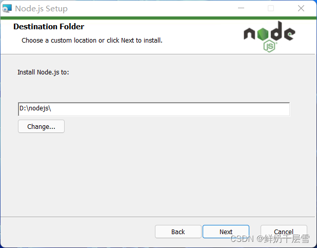

安装完成后打开指令窗口（cmd和powershell都可以，但都要以管理员身份运行），依次输入node -v 和 npm -v ，如果出现版本号表示安装的没问题，如图

接下来我们进行配置

找到你node.js的安装位置，在此位置下建立两个新文件夹，名称分别是node_cache和node_global，如图

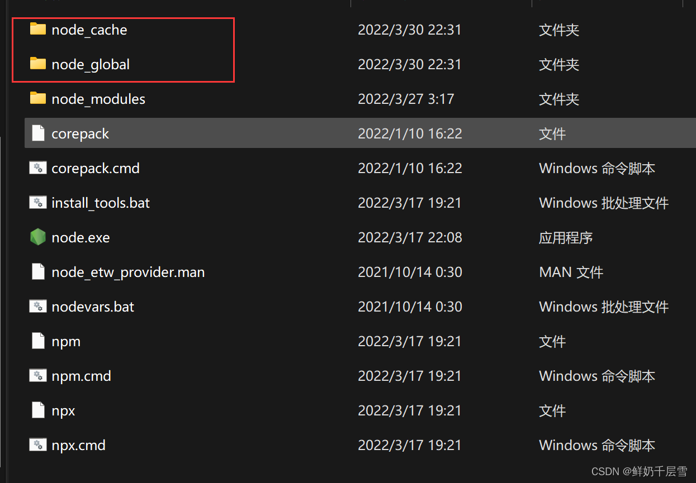

Cache是用来存放缓存的

Global是用来存放全局配置的

完事后我们进入命令窗口，输入如下两个指令来更改存放位置：

npm config set prefix “”（双引号里填你刚才建的node_global的路径）

npm config set cache “”（双引号里填你刚才建的node_cache的路径）

如图

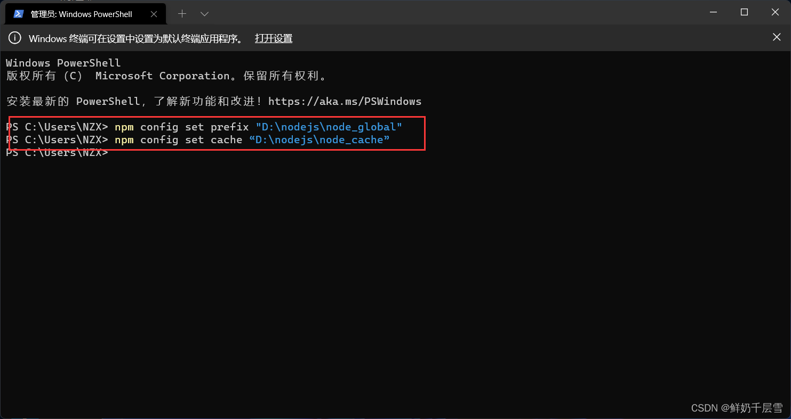

随后我们进入环境变量配置窗口（大家都会，就不多唠叨了），在上方用户变量中找到path点进去，把图中圈出来的该成刚才新建的node_global文件夹的路径

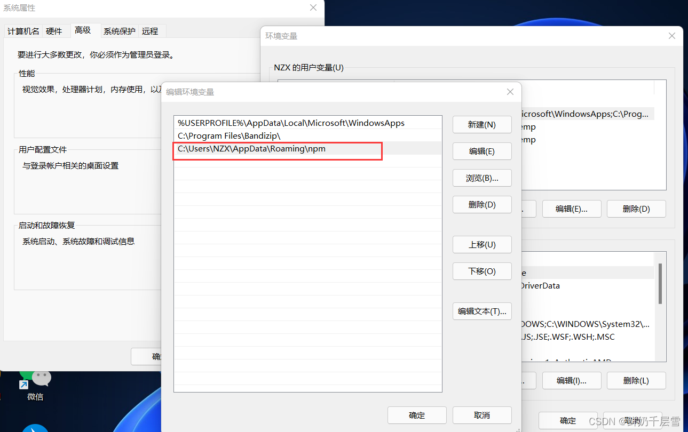

然后找到下方的系统变量，新建一个环境变量，变量名写成NODE_PATH（不要写错），变量值为node.js安装目录下的node_modules文件的路径，可参考图中我的

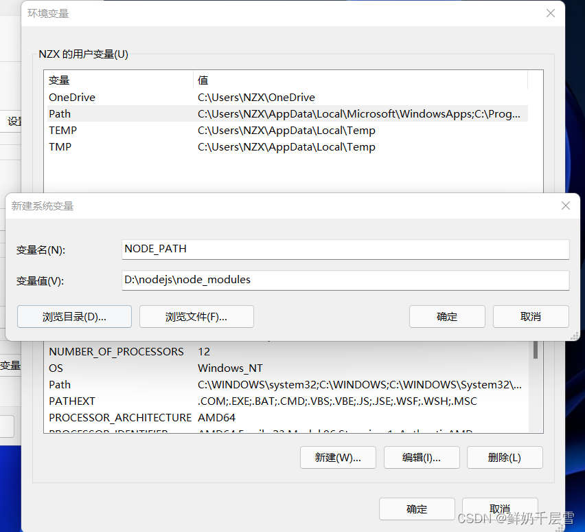

然后还是在下方的系统变量中找到path，添加一个名为%NODE_PATH%的变量，如图

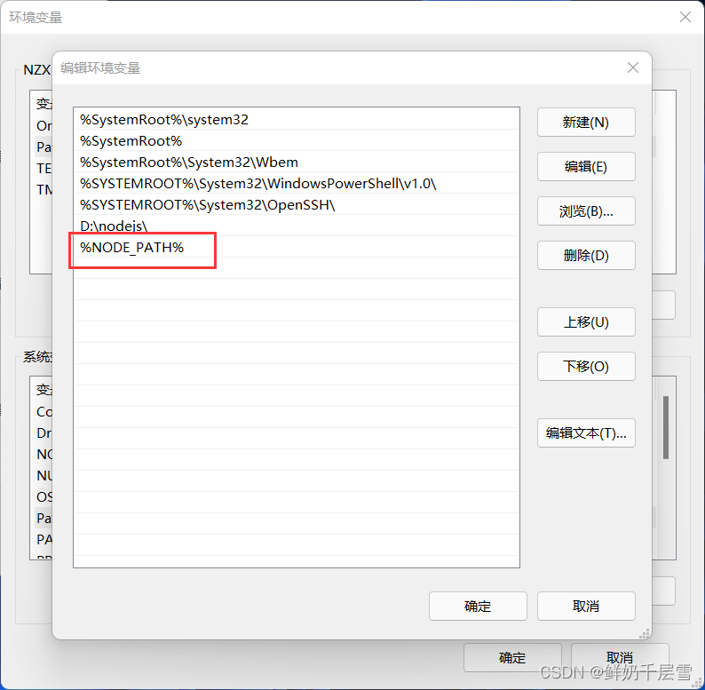

依次点击确定 退出变量窗口。

打开指令窗口，全局安装一个vue测试一下是否配置成功，输入指令：

npm install vue -g

如图

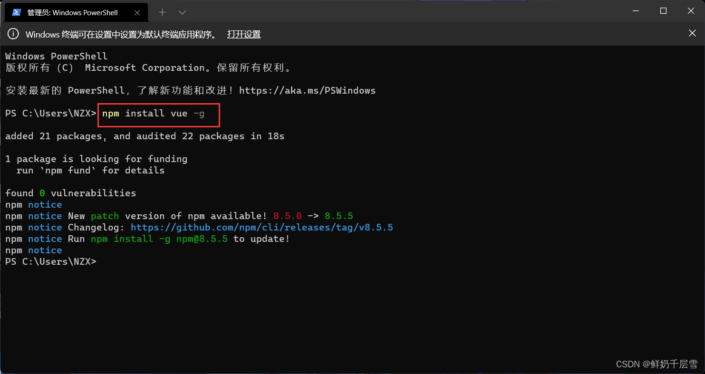

安装完以后去看看你之前新建的两个文件夹，有东西的话表示已经配置成功了

最后我们把npm配置成淘宝镜像（使用原有镜像的话会非常慢，甚至还会出现一些奇奇怪怪的报错）

在指令窗口输入：

npm config set registry http:// registry.npm.taobao.org

如图

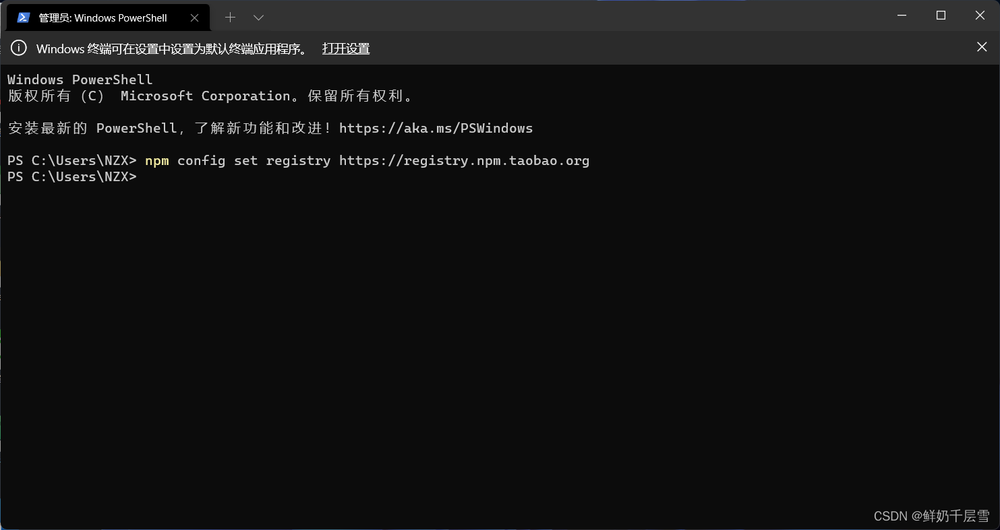

至此配置完成

安装vue脚手架

（1）在指令窗口输入

npm install -g @vue/cli

如图 （安装过程中的WARN警告属于正常情况，不必管它）

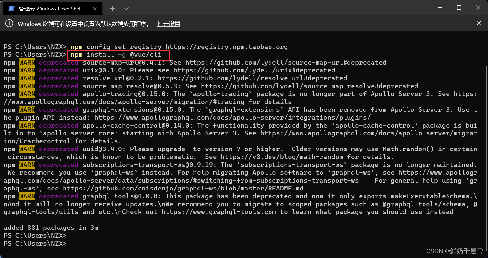

（2）我们在桌面建一个脚手架项目试试是否安装成功

依次输入指令

cd Desktop

vue create vue_test （vue_test是项目名称，大家可以根据自己的喜好来起名字）

注意：如果出现下图的报错，请进入node.js安装目录下的node_global文件夹下，把vue.ps1文件删除，如图

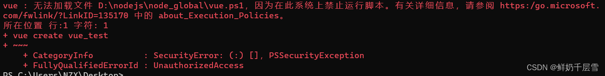

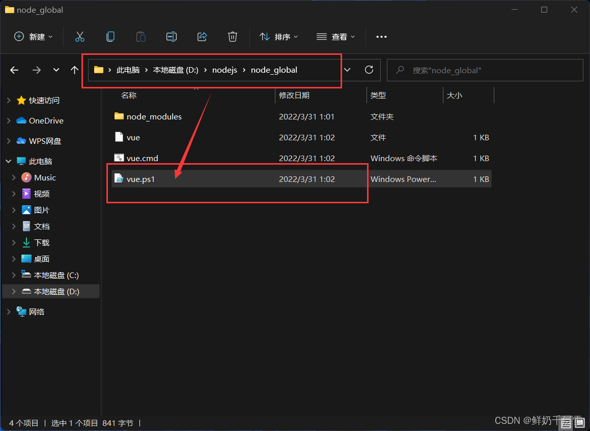

创建过程中会出现如下界面，我们用键盘控制选择vue2的选项

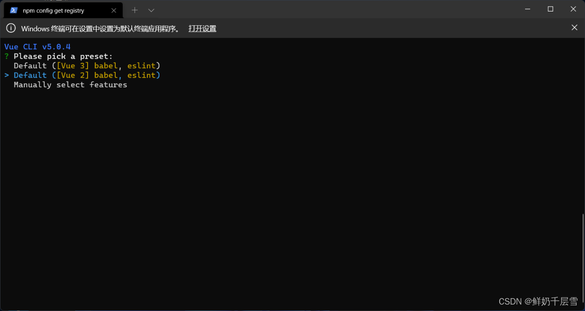

等待创建完成后我们先上后下依次执行图中圈出来的两个蓝色部分的指令（直接复制就行）

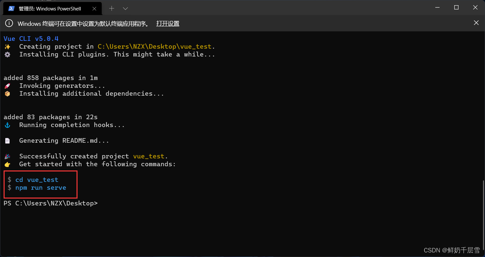

最后会给出两个地址，我们使用第一个就行

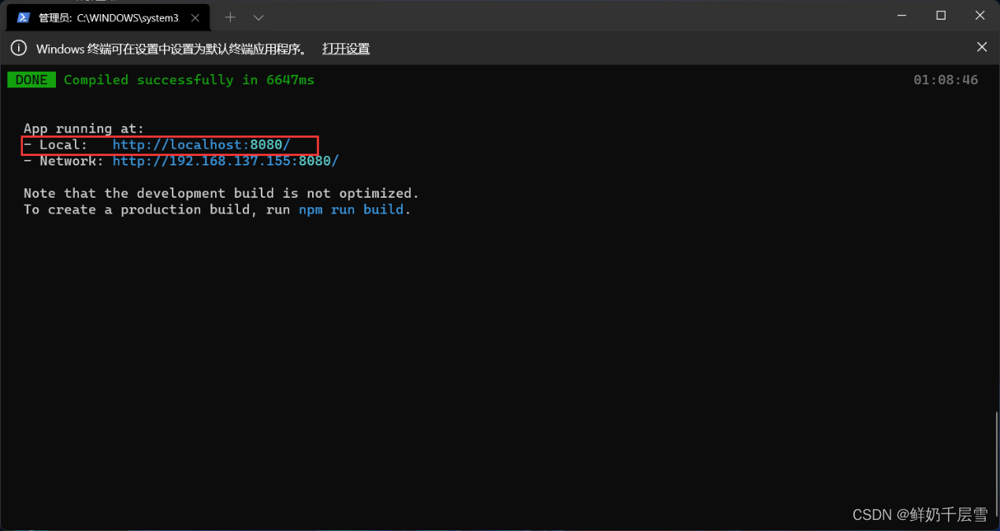

效果如下

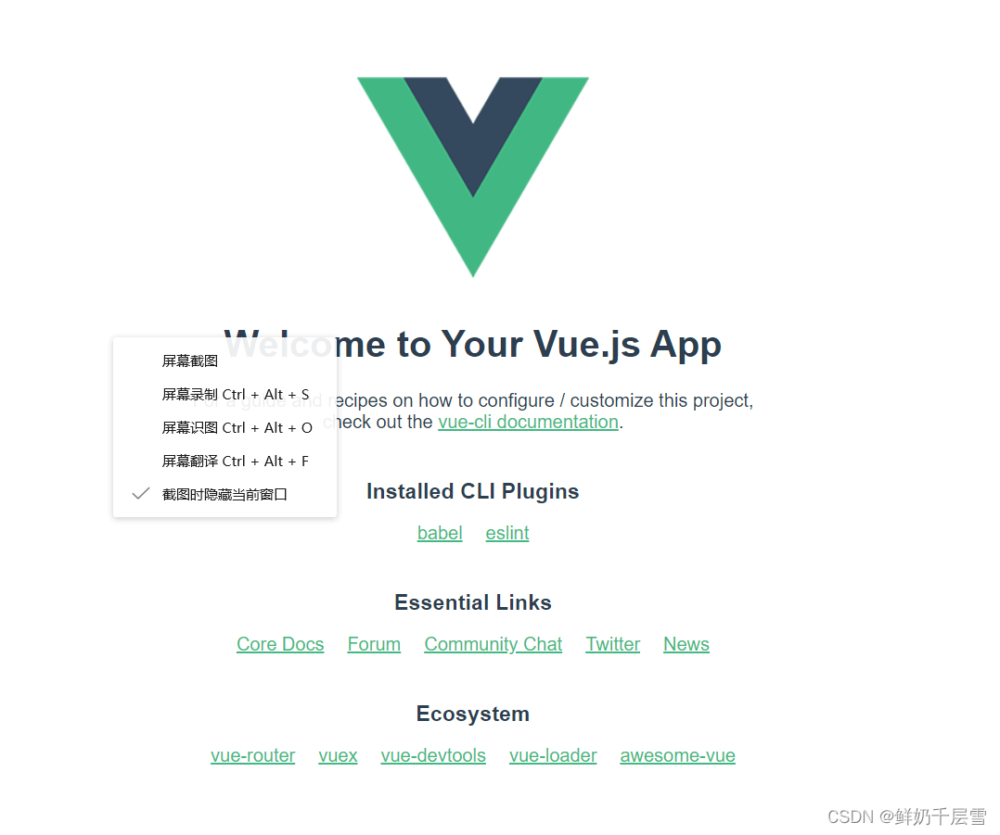

至此脚手架安装完成

安装webpack

打开命令窗口，执行以下指令

npm install webpack@3.6.0 -g

（@后面为指定安装的版本，比如这里安装的是3.6.0）

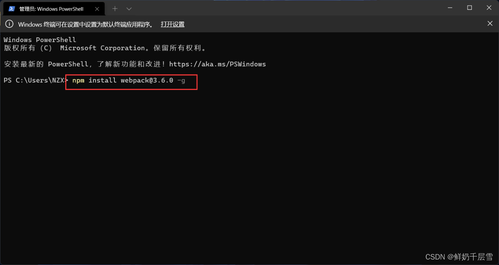

如图安装成功

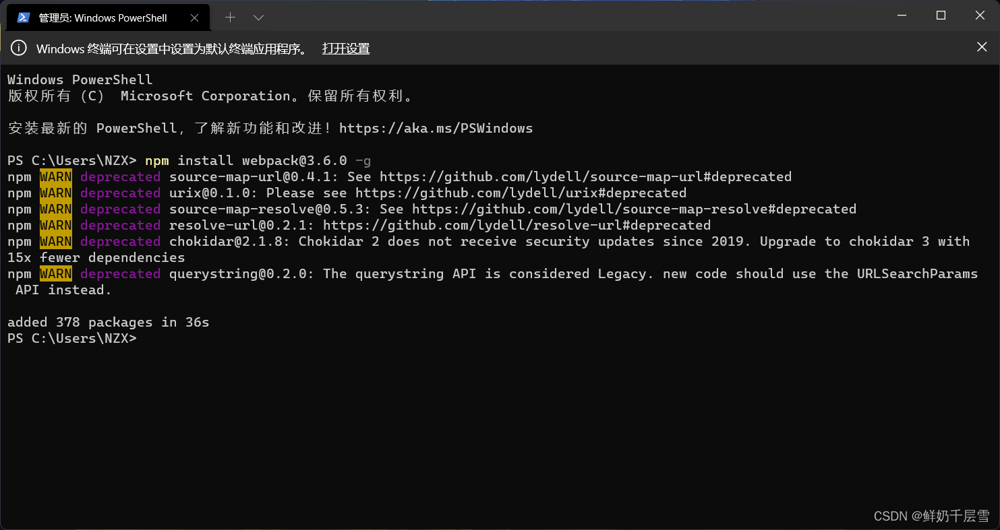

安装完成后在指令窗口输入webpack -v ，如果出现版本号表示安装的没问题。

————————————————

版权声明：本文为CSDN博主「鲜奶千层雪」的原创文章，遵循CC 4.0 BY-SA版权协议，转载请附上原文出处链接及本声明。

原文链接：https://blog.csdn.net/weixin_54368639/article/details/124174696